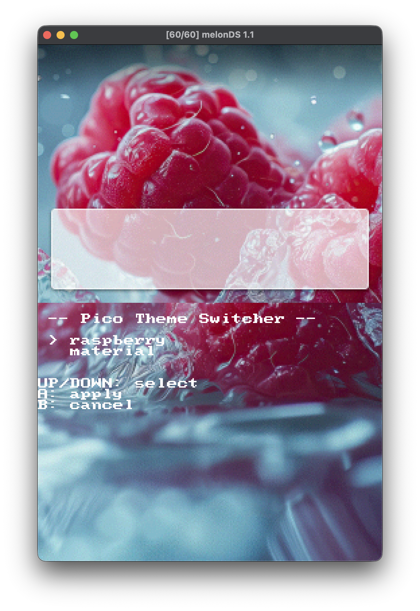
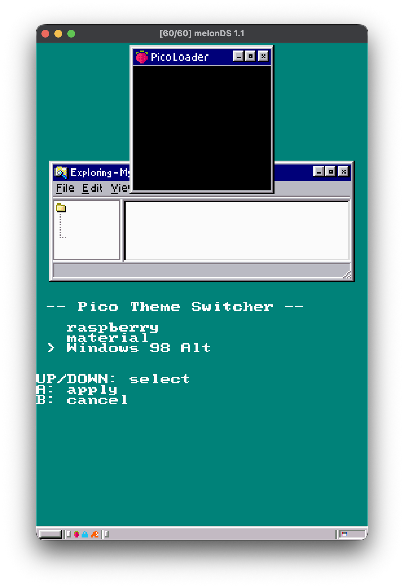

# DSPico Theme Loader
Pico Theme Loader is a small Nintendo DS app that lets you switch themes on the [Pico Launcher](https://github.com/LNH-team/pico-launcher/) by LNH Team.

## Screenshots

| | |
|---|---|
|  |  |
| Credits: LNH Team | Credits: [GBATemp user Noods](https://gbatemp.net/download/pico-launcher-windows-98-theme.39719/) |


## What this does
- Shows a list of themes already on your SD card.
- Lets you choose one theme using DS buttons.
- Applies your selected theme.

Important: This app does not download themes. You still need to copy theme folders to your SD card manually.

## What you need
- A DS set up with Pico Launcher.
- An SD card for your DS.
- Theme folders already copied to:
  - `_pico/themes`
- The app file:
  - `_pico-theme-loader.nds`

## Quick setup (for most users)
1. [Download](https://github.com/samallari/dspico-theme-loader/releases/download/v0.1.0/_pico-theme-loader.nds) or build `_pico-theme-loader.nds`.
2. Copy `_pico-theme-loader.nds` to the root of your SD card.
3. Make sure your themes are in `_pico/themes`.
4. Put the SD card back in your DS and start Pico Theme Loader.

## How to use on DS
1. Open Pico Theme Loader.
2. Use UP and DOWN to move through the theme list.
3. Press A to apply the selected theme.
4. Press B to cancel and go back.

## Troubleshooting
- No themes shown:
  - Check that theme folders are inside `_pico/themes`.
  - Check folder names and file structure are correct.
- App does not start:
  - Confirm `_pico-theme-loader.nds` is in the SD card root.
  - Re-copy the file in case the transfer was interrupted.

## For developers

### Build with Docker
1. Pull the build image:

```bash
docker image pull skylyrac/blocksds:slim-latest
```

2. Build the project:

```bash
docker run --rm -it -v ./:/work -w /work skylyrac/blocksds:slim-latest make clean
docker run --rm -it -v ./:/work -w /work skylyrac/blocksds:slim-latest make
```
